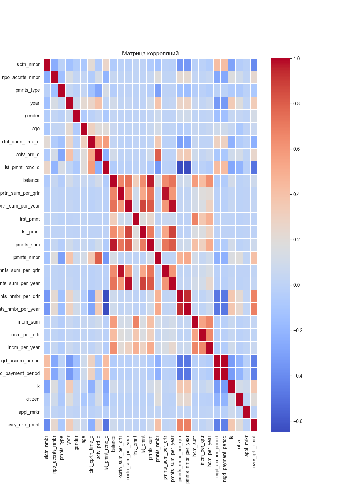
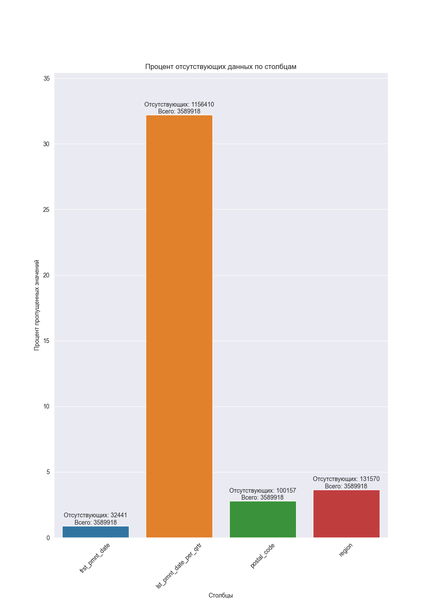

# Исследование и прогнозирование лояльности участников НПО
# Обучение
code good all содержит в себе код для обучения модели
# Графики
hackanalysis включает в себя функции для анализа данных и построения различных графиков

## Корелляция

## Пропущенные значения

